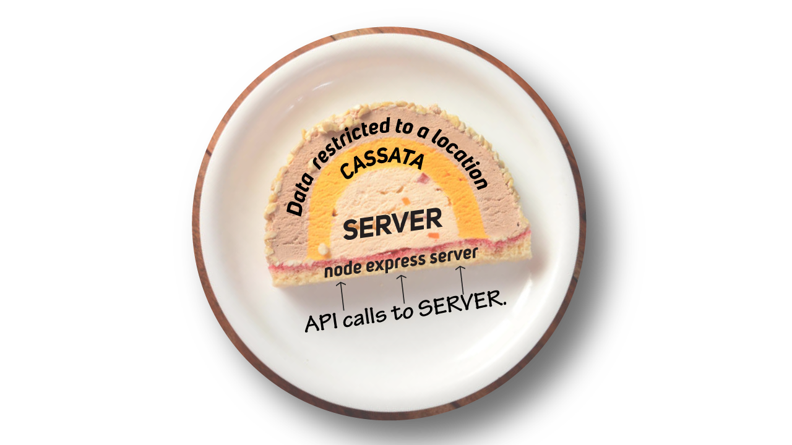
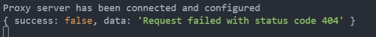
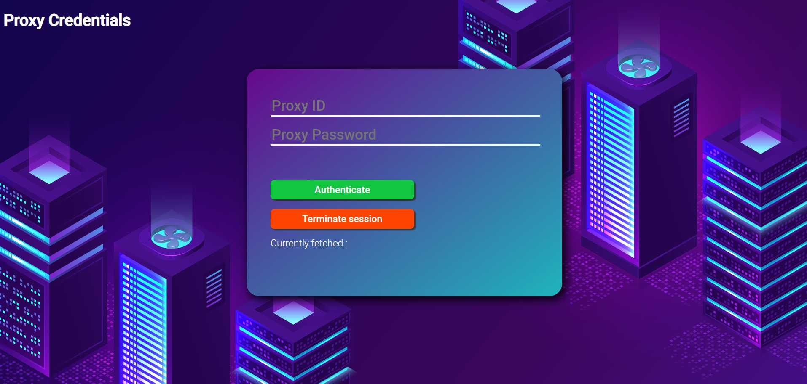
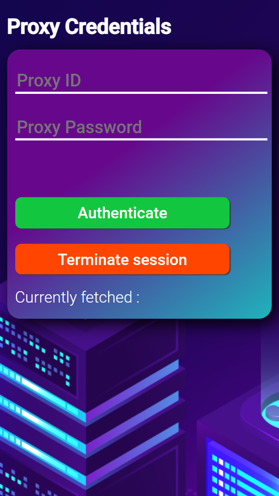
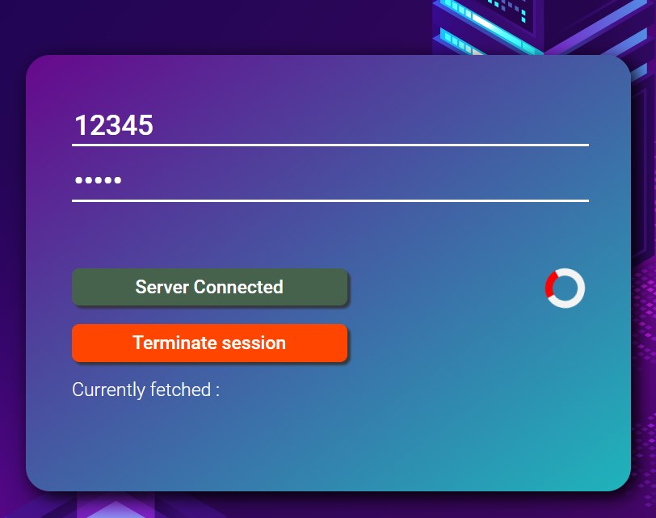
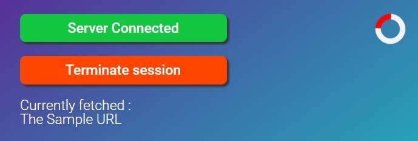

# CASSATA 🍥
## A NODE JS express server proxy, that's set as easy as a cake. 

### Hosting your server in a different location and need to access the data is only available in your location, this is a goto solution if you want to set your proxies for ***FREE \**** ..

(* Free) ~ You have to use your resources to login to your server proxy room and set them up, and nothing much 😸.

### A Quick overview
 - ### [The IDEA](#idea-)
   - [Concept behind CASSATA](#why-cassata-)
   - [Current progress and support](#progress-)
 - ### [Installing Cassata and usage](#installation-)
   - [Setting up the Proxy server](#setting-the-proxy-server-)
   - [Accessing from the client](#accessing-the-proxy-client-)
 - ### [A complete solution](#complete-example)


### IDEA :
 - The main idea is to use your own device IP in the location you need and access the data, and proxy them back to the server at a different location.
 - Secondly it uses your own resources for proxying the data, so no worries about data leaks, (note : YOUR DEVICE IP will not be altered, so they remain visible.)

### WHY CASSATA ? 
 
 - #### The main idea behind CASSATA is to wrap your sever with the IP of your local machine or mobile phone to access the data.

### PROGRESS :
- [x] Support for GET Requests   
- [x] Support for JSON
- [ ] Support for POST Requests

### INSTALLATION 🍰
### ```npm i --save cassata```

### Setting the PROXY (server) 👨‍💻
- #### IMPORT the package.
  ```
  let cassata = require('cassata');
  ```
- #### IMPORTANT ! 🔓 
    - Make sure you change the default proxy room auth details. By Default
        - PROXY ID : 12345
        - PASSWORD : admin
    #### CHANGING PROXY AUTH
    - ### ```cassata.proxySettings```
    ```
    cassata.proxySettings.roomId = "Your Room ID";
    cassata.proxySettings.password = "Your Password";
    ```
- #### Create your express server with all the required fields,
    ```
    const express = require('express');
    const app = express();
    // ... your declarations
    app.get('routes', async(req, res)=>{});
    ```
- #### Accessing the data through proxy.
  - ### ```cassata.getProxiedData(url, timeout)```
  - ### !! Important Make sure you connect to the proxy before making API calls through ```cassata.getProxiedData()```
  - #### Parameters 
     - ##### url : Should be a string, and the url must yield a JSON for successful call back.
     - ##### timeout*<small>optional</small> : number :: The timeout to wait for response from proxy client ***DEFAULT : 8000ms***.
  - #### Returns Object {success, data}
    - ##### success : true on success || false on error
    - ##### data : Response from proxy on success || Error on failure
  - You can wrap the method inside a get request and wait for it, or also have seperate method and call them.
  - ##### Method 1
    ```
    app.get("/samplRoute", async(req, res)=>{
        try{
            const response = await cassata.getProxiedData("the url that you want to hit");
            // process the response.
        } catch (error) {
            // Error handling, Cassata will return an error
        }
    })
    ```
  - ##### Method 2 (Feasible for accessing data on intervals)
    ```
    //Creating an async function, 
    async function foo(){
         try{
            const response = await cassata.getProxiedData("the url that you want to hit");
            // process the response.
        } catch (error) {
            // Error handling, Cassata will return an error
        }
    }

    // Call the function foo() at your will, and get the data.
    ```
  - #### Example of Failure condition from proxy : 
    
 - #### Checking if proxy client is connected
    - ### ```cassata.isProxyConnected()```
        - #### Returns true/false on client connection status.
 - #### Final steps
    - ##### *Make sure you add all the required data and set all the static files using express.static(), before calling this method.

    - ### ```cassata.createProxy(server)```
        - #### server : The express app that you created,
        - #### Returns : Proxied server / false on error. 
    ```
    const express = require('express');
    const app = express();

    // mention all middle wares
    app.use()

    // mention all your routes
    app.get()
    app.post()

    // mention all your static files
    app.use("/", express.static())

    // **** Initialize the proxy server ****

    let proxyServer = cassata.createProxy(app)
    proxyServer.listen(PORT, ()=>{
        console.log("Server started")
        // your initializations

        // !! Provide a buffer so you can get enough time to activate the proxy.
    })
- ### Complete Example
    ```
    //  Creating the express server
    const express = require('express');
    const app = express();

    // Importing the Package
    const cassata = require("cassata");
    cassata.proxySettings.roomId = "@123$32";
    cassata.proxySettings.password = "$ource#12";

    // This will be your API end point that is only available in your location 
    const API_END_POINT = "https://*" 

    // Method 1 ~ Suitable for instant response.
    app.get("/", async (req, res)=>{
        console.log("This is from your get request section")
        try {
            const response = await cassata.getProxiedData(API_END_POINT);
            // Process the response object here : {success : boolean, data : Response from API_END_POINT}
        } catch (error) {
            // Handle your errors here
        }
    });


    // Method 2 ~ Suitable for making multiple API calls
    async function foo(url){
        try {
            const response = await cassata.getProxiedData(url);
            return response.data;
        } catch (error) {
            return error;
        }
    }

    //  ** Now you can call the function foo(url), at any point and get the response.

    // ** set your static files
    app.use(express.static(**));

    // After setting up all the static files, make sure you create the proxy server,
    let proxyServer = cassata.createProxy(app);
    proxyServer.listen(process.ENV.PORT || 5000, ()=>{
        console.log("Server started");
        // Your initializations
    })
    ```
- ### That's it you have your proxy server, and you can host it in any location. 🛰 

### Accessing the Proxy (Client) 🐱
- #### Once you have hosted your server, you can visit the proxy server room by just adding ```/proxyrouter``` to the url of your server. Once done, this is what you will see.
- ### ***CASSATA*** only allows one session per time, so once connected, another session of ***CASSATA*** will not be available until you terminate the session through RELOAD / Terminate Session.
    - ### Make sure you have your passwords safe, else you might want to change them in your server.
- This is what it looks like on computers. 
- The mobile version. <br/>

- ### !!! Make sure you only reload when you want to terminate the session. !!!
- #### Once in, provide your credentials that you gave during the setup of the server
    - #### PROXY ID : roomId
    - #### PROXY Password : password
- #### On successful connection with the server, you will get a circular indicator, stating the connection, IF(spin == true) : connection success 🎈.
    - The circular indicator states the connection is success <br/>
    
- ### On completion until here, now your server will access the data using your IP (the device that you gave the credentials in), from the method ```cassata.getProxiedData()```

- #### You will be updated live, regarding the requests that your server is making, 
    - The url will be displayed in the currently fetched section : 
    

- ### The session will be persistant until you wish to reload / Until your server is up / Or you wish to terminate the session though Terminate session.


background image of the proxyrouter : <a href="http://www.freepik.com">Designed by upklyak / Freepik</a>

### Kindly feel free to raise PR for new updates, and issues if any.

### Thankyou 💚 